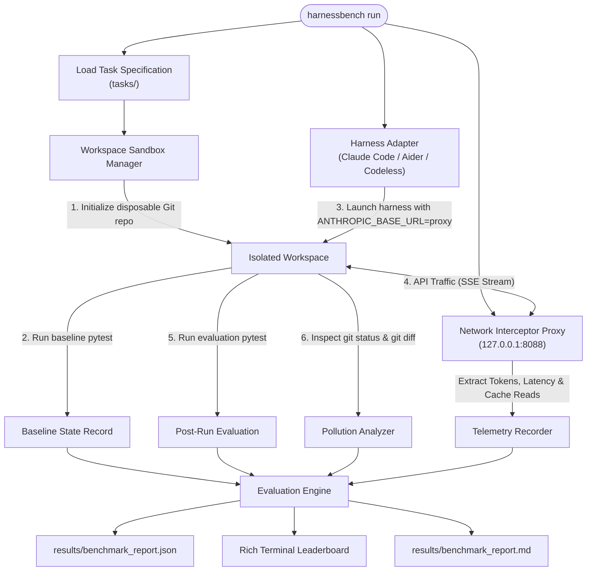

<div align="center">

#  HarnessBench

### The First Independent Benchmarking Framework for AI Coding Agent Harnesses

[](tests/)
[](tasks/)
[](pyproject.toml)
[](LICENSE)
[](https://github.com/Shikhaar/HarnessBench)
[](https://github.com/Shikhaar/HarnessBench/pulls)

<br/>

**Holding the LLM constant to measure what truly matters in production: execution harnesses across Python, TypeScript, Go, and Java.**

[Overview](#-the-problem) • [Architecture](#-architecture) • [Metrics](#-core-metrics-captured) • [Task Suite](#-12-task-cross-language-suite) • [Quickstart](#-quickstart) • [Running Benchmarks](#-running-the-benchmark) • [Adding Adapters](#-adding-a-harness-adapter) • [Leaderboard](LEADERBOARD.md)

</div>

---

## The Problem

Existing benchmarks (like **SWE-bench** or **HumanEval**) measure raw model intelligence. However, in real-world software development, engineers don't execute raw models—they run **agent harnesses** (such as **Claude Code**, **Aider**, **Codeless**, **OpenHands**, and custom internal CLI agents).

In practice, **the execution harness is 50–70% of the battle**:
* **Cache Invalidation:** Poorly constructed harnesses break Anthropic or OpenAI prompt cache prefixes on every turn, causing API costs to skyrocket by **5x to 10x**.
* **Context Overkill & Token Bloat:** Blindly injecting massive repository maps or entire files exhausts context windows and induces hallucinations.
* **Repository Pollution:** Agents frequently leave behind uncommitted scratchpads, temporary markdown notes, or extraneous modified files that create technical debt.
* **Regression Hazards:** A harness might "fix" the designated bug while silently breaking three previously passing features.
* **Distorted Self-Reporting:** Relying on the harness to report its own token usage often hides sub-queries, internal search steps, or background indexers.

### The Core Hypothesis

> **Given the same LLM, repository, task, tests, and environment, different coding harnesses produce radically different outcomes in correctness, financial cost, latency, token efficiency, repository cleanliness, and regression safety.**

HarnessBench makes these differences **measurable, reproducible, and verifiable**.

---

## Key Features

| Feature | Description |
| :--- | :--- |
| ** Wire-Level Telemetry** | Intercepts HTTP/SSE traffic (`127.0.0.1:8088`) at the network layer. Never trusts harness self-reporting. |
| ** Two-Stage Regression Guard** | Runs baseline tests *before* and *after* execution. Regressions are immediately caught and penalized. |
| ** Repo Pollution Analysis** | Deep inspection of `git status --porcelain` and diffs to penalize scratch files, debug dumps, and unrelated edits. |
| ** True Cost Engine** | Real-time dollar costing using provider rate cards (accounting for input, output, cache-read, and cache-write). |
| ** Disposable Git Sandboxes** | Every task run receives a fresh, isolated Git workspace. Zero cross-contamination. |
| ** Rich CLI & Visual Reports** | Terminal leaderboards powered by Rich, structured JSON artifacts, and exportable Markdown reports. |

---

## Architecture

HarnessBench operates as an orchestration harness around isolated workspaces and a network proxy:



---

## Core Metrics Captured

For every benchmark execution, HarnessBench captures ground-truth metrics:

```text
┌───────────────────────────┬───────────────────────────────┬────────────────────────────────────────────────────────┐
│ Metric                    │ Ground Truth Source           │ Formula / Description                                  │
├───────────────────────────┼───────────────────────────────┼────────────────────────────────────────────────────────┤
│ Pass Rate & Success       │ Sandboxed Pytest Runner       │ post_tests_passed AND NOT regression_detected          │
│ Regression Safety         │ Baseline vs Post-Run Pytest   │ baseline_passed == True AND post_passed == False       │
│ Wire Tokens (In / Out)    │ Network Interceptor Proxy     │ Exact provider usage headers and SSE event deltas      │
│ Prompt Cache Reads        │ Network Interceptor Proxy     │ Anthropic cache_read_input_tokens (cache savings)      │
│ True API Cost ($)         │ Model Pricing Engine          │ (in * rate_in + out * rate_out + cache * rate_c) / 10⁶ │
│ Repository Pollution      │ Git Status & Diff Forensics   │ Untracked files + 2*(unrelated files + unexpected dirs)│
│ Execution Latency         │ High-resolution Timer         │ Total wall-clock time from launch to exit              │
│ Turn Count                │ Proxy Wire Telemetry          │ Total HTTP interaction cycles                          │
└───────────────────────────┴───────────────────────────────┴────────────────────────────────────────────────────────┘
```

---

## Quickstart

### Prerequisites
* **Python 3.11+**
* **Git**

### 1. Installation

```bash
# Clone the repository
git clone https://github.com/Shikhaar/HarnessBench.git
cd HarnessBench

# Create virtual environment
python -m venv .venv

# Activate virtual environment
# Windows:
.\.venv\Scripts\activate
# Linux / macOS:
source .venv/bin/activate

# Install in editable mode with dev dependencies
pip install -e .
```

Verify your installation:
```bash
harnessbench version
harnessbench harnesses
harnessbench tasks
```

---

## Running the Benchmark

### 1. Zero-Cost Dry Run (Mock Adapter)
Validate the full evaluation pipeline, sandboxing, and reporting locally without an API key:
```bash
harnessbench run --harnesses mock --tasks all --model claude-3-5-sonnet-20241022
```

### 2. Benchmarking Real Coding Agents
Hold the model constant (e.g. `claude-3-5-sonnet-20241022`) to compare **Claude Code**, **Aider**, and **Codeless**:

```bash
export ANTHROPIC_API_KEY="sk-ant-..."

harnessbench run \
    --harnesses aider,claude,codeless \
    --tasks all \
    --model claude-3-5-sonnet-20241022 \
    --timeout 300 \
    --output-dir results/
```

### 3. Viewing the Leaderboard
View the terminal leaderboard at any time from saved benchmark reports:

```bash
harnessbench leaderboard --report results/benchmark_report.json
```

**Terminal Output Preview:**
```text
                       HarnessBench — Coding Agent Harness Leaderboard                       
┌──────────┬─────────────────────────────┬───────────┬────────────┬─────────────────┬────────────┬───────┬─────────┬───────────┬─────────────┐
│ Harness  │ Model                       │ Pass Rate │ Total Cost │ Tokens (In/Out) │ Cache Read │ Turns │ Latency │ Pollution │ Regressions │
├──────────┼─────────────────────────────┼───────────┼────────────┼─────────────────┼────────────┼───────┼─────────┼───────────┼─────────────┤
│ claude   │ claude-3-5-sonnet-20241022  │    3/3    │  $0.1420   │ 32,450 / 2,120  │   45,100   │  12   │  48.2s  │     0     │      0      │
│ codeless │ claude-3-5-sonnet-20241022  │    3/3    │  $0.1840   │ 41,200 / 3,050  │   38,900   │  14   │  52.1s  │     1     │      0      │
│ aider    │ claude-3-5-sonnet-20241022  │    2/3    │  $0.2450   │ 58,100 / 4,200  │   12,000   │  19   │  74.5s  │     2     │      0      │
└──────────┴─────────────────────────────┴───────────┴────────────┴─────────────────┴────────────┴───────┴─────────┴───────────┴─────────────┘
```

---

## The Network Interceptor Proxy

Harnesses often under-report or omit token consumption for background indexers or sub-agent queries. HarnessBench avoids this via a local reverse proxy (`bench/telemetry/proxy.py`):

```text
Harness Process  ───>  ANTHROPIC_BASE_URL (http://127.0.0.1:8088)
                             │
                             ├── 1. Capture request metadata & timestamp
                             ├── 2. Forward request to https://api.anthropic.com
                             ├── 3. Intercept Server-Sent Events (SSE) streaming chunks
                             │      • Parse message_start (input & cache-read tokens)
                             │      • Parse message_delta (output tokens)
                             │      • Stream chunks in real-time back to harness
                             └── 4. Calculate exact USD cost using model rate card
```

You can also run the proxy standalone for manual testing:
```bash
harnessbench serve-proxy --port 8088 --host 127.0.0.1
```

---

## Benchmark Tasks Included

HarnessBench ships with 3 carefully curated, deterministic benchmark challenges:

| Task ID | Type | Description | Expected Files |
| :--- | :--- | :--- | :--- |
| `python_bugfix_001` | **Algorithmic Bug** | Fixes an inverted elapsed time subtraction in a Token Bucket rate limiter refill method. | `src/rate_limiter.py` |
| `python_refactor_001` | **Multi-file Refactor** | Extracts configuration parsing into `src/config.py` while preserving backward compatibility for `ApiClient`. | `src/config.py`, `src/client.py` |
| `python_dependency_001` | **Dependency Compat** | Resolves `AttributeError: collections.Mapping` on Python 3.10+ by migrating to `collections.abc.Mapping`. | `src/sanitizer.py` |

---

## Adding a Harness Adapter

Adding support for any coding harness requires only a small adapter subclassing `BaseHarnessAdapter`:

```python
# src/harnessbench/adapters/my_agent.py
from pathlib import Path
from typing import Dict
from harnessbench.adapters.base import BaseHarnessAdapter
from harnessbench.execution.process import run_command_safe
from harnessbench.models import HarnessExecutionResult

class MyAgentAdapter(BaseHarnessAdapter):
    @property
    def name(self) -> str:
        return "my_agent"

    def setup(self, cwd: Path, env: Dict[str, str]) -> None:
        """Workspace preparation (if needed)."""
        pass

    def run(self, prompt: str, cwd: Path, env: Dict[str, str], timeout: int = 300) -> HarnessExecutionResult:
        cmd = ["my-agent", "--prompt", prompt, "--headless"]
        return run_command_safe(cmd, cwd=cwd, env=env, timeout=timeout)

    def teardown(self, cwd: Path) -> None:
        """Post-run cleanup (if needed)."""
        pass
```

Register your adapter in `src/harnessbench/adapters/__init__.py` and it immediately appears in `harnessbench harnesses`.

---

## Security Model

- **Process Isolation:** Harnesses are spawned inside disposable temporary Git worktrees.
- **Secret Redaction:** `scrub_secrets()` automatically redacts `ANTHROPIC_API_KEY`, `OPENAI_API_KEY`, and bearer tokens matching `sk-...` or `ant-...` from logs, stdout/stderr, and persisted JSON results.
- **No Secret Persistence:** The network proxy forwards client authorization headers upstream in-memory without writing secrets to disk.

---

## Roadmap

- [x] Initial production MVP with Anthropic reverse proxy
- [x] 3 core adapters: Claude Code, Aider, Codeless (+ Mock)
- [x] 3 initial Python benchmark tasks
- [x] Repository pollution forensics & regression detection
- [x] Rich terminal leaderboard & JSON/Markdown reports
- [ ] OpenAI and Ollama/Local model SSE proxy decoders
- [ ] Granular JUnit XML per-test function regression diffing
- [ ] SWE-bench Lite automated task suite importer
- [ ] Interactive HTML web dashboard and diff viewer

---

## Documentation

For in-depth architectural details, mathematical metric definitions, and task authoring guidelines, see [docs/project_overview.md](docs/project_overview.md).

---

## Contributing & Community

Contributions are warmly welcomed!
1. Fork the repository
2. Create a feature branch (`git checkout -b feature/new-adapter`)
3. Run test suite: `pytest`
4. Commit your changes (`git commit -m 'feat: add new adapter'`)
5. Push to the branch (`git push origin feature/new-adapter`)
6. Open a Pull Request

---

## License

Distributed under the MIT License. See [LICENSE](LICENSE) for more information.
