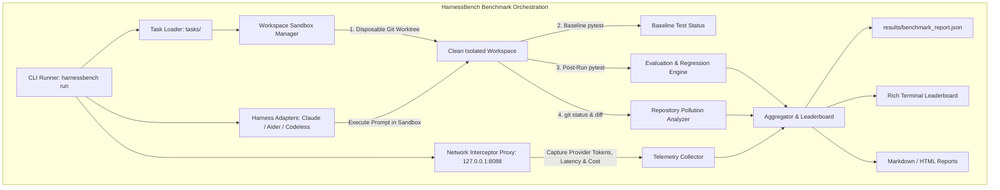

# HarnessBench 🏇

[](LICENSE)
[](pyproject.toml)
[](src/harnessbench)

> **HarnessBench evaluates the harness as the independent variable while controlling the model, task, repository, tests, and environment.**

---

## 1. What is HarnessBench?

**HarnessBench** is an open-source benchmarking framework designed to evaluate, compare, and rank **AI coding agent execution harnesses** (such as [Claude Code](https://claude.ai/code), [Aider](https://aider.chat), [Codeless](https://github.com), and custom agent runtimes) while holding the underlying Large Language Model (LLM) strictly constant.

Existing benchmarks (such as SWE-bench) evaluate raw base model intelligence. However, in real-world software engineering, success, cost, and developer experience are heavily dictated by the **execution harness**:
- How the harness manages context and compacts token history
- Whether it utilizes prompt caching efficiently or breaks cache prefixes on every turn
- How tool schemas and search commands are constructed
- Whether it pollutes the repository with untracked scratchpads, temporary debug files, or broken diffs
- How it prevents regressions against pre-existing test suites

HarnessBench makes these harness-level trade-offs measurable, transparent, and reproducible.

---

## 2. Architecture Overview



---

## 3. Core Metrics Captured

For every benchmark execution, HarnessBench captures:

| Metric | Source | Description |
| :--- | :--- | :--- |
| **Pass Rate & Success** | Pytest / Sandbox | Did the agent resolve the task tests without regressions? |
| **Regression Safety** | Baseline vs Post | Did the harness break pre-existing tests that were previously green? |
| **Token Efficiency** | Network Proxy | Exact input, output, cache-read, and cache-write tokens at wire level. |
| **True API Cost ($)** | Pricing Model | Calculated directly from provider rate cards (e.g. Anthropic/OpenAI). |
| **Repo Pollution Score** | Git Status / Diff | Penalties for untracked scratch files, unexpected directories, or unrelated code mutations. |
| **Turn Count** | Telemetry Stream | Number of interactive agent turns and LLM calls. |
| **Execution Latency** | Wall-clock Timer | Total duration from harness launch to completion. |

---

## 4. Quickstart & Installation

### Prerequisites
- Python 3.11+
- Git

### Installation

Clone the repository and install dependencies using `uv`, `poetry`, or standard `pip`:

```bash
git clone https://github.com/your-org/HarnessBench.git
cd HarnessBench

# Create virtual environment
python -m venv .venv
source .venv/bin/activate  # On Windows: .\.venv\Scripts\activate

# Install in editable mode
pip install -e .
```

Verify the installation:
```bash
harnessbench version
harnessbench harnesses
harnessbench tasks
```

---

## 5. Running the Benchmark

### Zero-Cost Dry Run (Mock Adapter)
Validate the entire pipeline without calling external APIs:
```bash
harnessbench run --harnesses mock --tasks all --model claude-3-5-sonnet-20241022
```

### Benchmarking Real Coding Agents
To benchmark Claude Code, Aider, or Codeless holding `claude-3-5-sonnet-20241022` constant:

```bash
export ANTHROPIC_API_KEY="your-api-key"

harnessbench run \
    --harnesses aider,claude,codeless \
    --tasks all \
    --model claude-3-5-sonnet-20241022 \
    --timeout 300
```

### Viewing the Leaderboard
View the terminal leaderboard from any previously saved report:
```bash
harnessbench leaderboard --report results/benchmark_report.json
```

Example Leaderboard output:
```text
                       HarnessBench — Coding Agent Harness Leaderboard                       
┌──────────┬─────────────────────────────┬───────────┬────────────┬─────────────────┬────────────┬───────┬─────────┬───────────┬─────────────┐
│ Harness  │ Model                       │ Pass Rate │ Total Cost │ Tokens (In/Out) │ Cache Read │ Turns │ Latency │ Pollution │ Regressions │
├──────────┼─────────────────────────────┼───────────┼────────────┼─────────────────┼────────────┼───────┼─────────┼───────────┼─────────────┤
│ claude   │ claude-3-5-sonnet-20241022  │    3/3    │  $0.1420   │ 32,450 / 2,120  │   45,100   │  12   │  48.2s  │     0     │      0      │
│ codeless │ claude-3-5-sonnet-20241022  │    3/3    │  $0.1840   │ 41,200 / 3,050  │   38,900   │  14   │  52.1s  │     1     │      0      │
│ aider    │ claude-3-5-sonnet-20241022  │    2/3    │  $0.2450   │ 58,100 / 4,200  │   12,000   │  19   │  74.5s  │     2     │      0      │
└──────────┴─────────────────────────────┴───────────┴────────────┴─────────────────┴────────────┴───────┴─────────┴───────────┴─────────────┘
```

---

## 6. How the Network Interceptor Proxy Works

Most coding harnesses support directing network traffic through `ANTHROPIC_BASE_URL` or `OPENAI_BASE_URL`.

When `harnessbench run` starts:
1. HarnessBench spins up a lightweight async reverse proxy on `http://127.0.0.1:8088`.
2. Harnesses are invoked with `ANTHROPIC_BASE_URL=http://127.0.0.1:8088`.
3. The proxy intercepts every HTTP request, forwards it upstream, and intercepts the response.
4. For Server-Sent Events (SSE) streaming responses, the proxy inspects `message_start` and `message_delta` events in real-time to extract **ground-truth provider token counts** (including cached input tokens) before streaming the bytes directly back to the agent.
5. **No trust in self-reporting**: The proxy ensures accurate token and cost numbers regardless of whether the harness reports them.

You can also run the proxy independently for debugging:
```bash
harnessbench serve-proxy --port 8088
```

---

## 7. Adding a New Harness Adapter

Implement `BaseHarnessAdapter` in `src/harnessbench/adapters/`:

```python
from pathlib import Path
from typing import Dict
from harnessbench.adapters.base import BaseHarnessAdapter
from harnessbench.execution.process import run_command_safe
from harnessbench.models import HarnessExecutionResult

class MyAgentAdapter(BaseHarnessAdapter):
    @property
    def name(self) -> str:
        return "my_agent"

    def setup(self, cwd: Path, env: Dict[str, str]) -> None:
        pass

    def run(self, prompt: str, cwd: Path, env: Dict[str, str], timeout: int = 300) -> HarnessExecutionResult:
        cmd = ["my-agent", "--prompt", prompt, "--headless"]
        return run_command_safe(cmd, cwd=cwd, env=env, timeout=timeout)

    def teardown(self, cwd: Path) -> None:
        pass
```

Register your adapter in `src/harnessbench/adapters/__init__.py`.

---

## 8. Adding a Benchmark Task

Each task directory in `tasks/` contains:

```text
tasks/my_custom_task/
├── task.json                 # Metadata & expected modified files
├── prompt.md                 # Clear instructions provided to the agent
├── golden_solution.patch     # Reference patch
└── workspace/                # Seed repository files
    ├── src/
    ├── tests/
    │   └── test_baseline.py  # Baseline tests verifying clean initial state
    └── test_eval.py          # Rigorous evaluation test verifying task completion
```

Example `task.json`:
```json
{
  "id": "python_refactor_002",
  "name": "Async DB Connection Pool Migration",
  "description": "Migrate synchronous SQLite queries to connection pool with context manager.",
  "expected_files": [
    "src/database.py"
  ]
}
```

---

## 9. Security Model

- **Subprocess Isolation**: Harnesses run inside fresh, isolated temporary Git worktrees.
- **Secret Redaction**: API keys and auth tokens (`sk-...`, `ant-...`, etc.) are automatically scrubbed from all execution logs, stdout, stderr, and result JSON artifacts.
- **Workspace Containment**: No harness run can modify the original repository or cross-contaminate another run.

---

## 10. Roadmap

- [x] Initial MVP with Anthropic-compatible reverse proxy
- [x] 3 core adapters: Claude Code, Aider, Codeless (+ Mock)
- [x] 3 initial benchmark tasks (Bugfix, Refactor, Dependency compatibility)
- [x] Repository pollution analyzer & regression detector
- [x] Rich terminal leaderboard & JSON/Markdown report generators
- [ ] OpenAI and Ollama/Local model proxy wire capture
- [ ] Git worktree execution mode alongside disposable temp trees
- [ ] SWE-bench Lite task suite importer
- [ ] Automated HTML visual report dashboard

---

## License

MIT License. See [LICENSE](LICENSE) for details.
